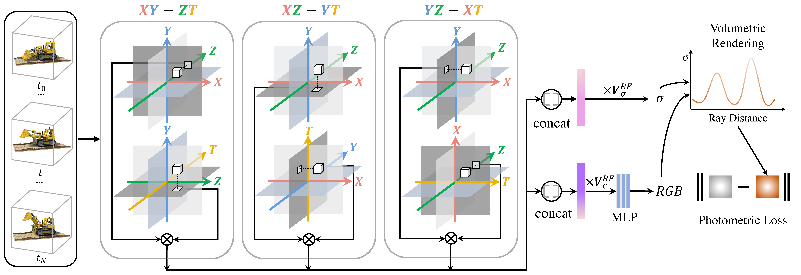

# HexPlane: A Fast Representation for Dynamic Scenes. (CVPR 2023)
This is the code for our CVPR 2023 paper :
[HexPlane: A Fast Representation for Dynamic Scenes](https://caoang327.github.io/HexPlane/)

[Ang Cao](https://caoang327.github.io),
[Justin Johnson](https://web.eecs.umich.edu/~justincj)


**HexPlane is an elegant solution to explicitly represent dynamic 3D scenes, decomposing a 4D spacetime grid into six feature planes spanning each pair of coordinate axes (e.g., XY, ZT). It computes a feature vector for a 4D point in spacetime by projecting the point onto each feature plane. then aggregating the six resulting feature vectors. The fused feature vector is then passed to a tiny MLP which predicts the color of the point; novel views can then be rendered via volume rendering.** 

If you have any questions, please feel free to email me at ancao@umich.edu.

# Environment Setup
```
    # create conda environment
    conda create --name hexplane python=3.8
    
    # activate env
    conda activate hexplane
    conda install pytorch==1.12.1 torchvision==0.13.1 torchaudio==0.12.1  cudatoolkit=11.6 -c pytorch -c conda-forge

    # pip install 
    pip install -r requirements.txt
    python setup.py develop

```
# Data Preparation
Both [D-NeRF dataset](https://github.com/albertpumarola/D-NeRF)  and [Plenoptic Dataset](https://github.com/facebookresearch/Neural_3D_Video) could be downloaded from their official websites. 

Please change the "datadir" in config based on the locations of downloaded datasets.

# Reconstruction
```
python main.py config=dnerf_slim.yaml
```
We provide several config files under [config](./config/) folder for different datasets and models.

We have two models which are controlled by `model_name`: `"HexPlane_Slim"` and `"HexPlane"`.

`"HexPlane"` is the complete HexPlane model, whose *Fusion Mechanism*, *Density Field* are controllable. 

*Fusion Mechanism*: HexPlane computes features from six feature planes, where two complementary planes (like XY and ZT) are paired and there are three pairs in total. 
Consequently, there are two fusion steps to fuse features from six planes. 
`fusion_one` controls the fusion operation between paired feature planes, leading to three fused features, and `fusion_two` controls the operation between three fused features.
Both fusion operation could be chosen from `multiply`, `sum` and `concat`.

*Density Field*: the density of reconstructed scenes could be either directly regressed from density HexPlane or regressed from MLPs like [EG3D](https://nvlabs.github.io/eg3d/). More specifically, `density_dim` controls the calculated feature dimensions from density HexPlane. `DensityMode` controls whether the density values are calculated directly from HexPlane or regressed from MLPs with extracted features as inputs. 
Setting `density_dim=1` and `DensityMode="plain"` means directly extracting densities from HexPlane without any density MLPs.
Setting `density_dim=8` and `DensityMode="general_MLP"` mean extracting 8-dim features from density HexPlane and regressing these features into density scalers using MLPs. The input and width of MLPs are controlled by Density Regressor MLP settings.

`"HexPlane_Slim"` is a special model assuming `fusion_one="multiply"`, `fusion_two="concat"`,
`DensityMode="plain"`  and `density_dim=1`. It is slightly more efficient compared to `"HexPlane_Slim"`.

# Evaluation
With `render_test=True`, `render_path=True`, results at test viewpoint are automatically evaluated and validation viewpoints are generated after reconstruction.  

Or
```
python main.py config=dnerf_slim.yaml systems.ckpt="checkpoint/path" render_only=True
```

# [iPhone Dataset Code](./docs/iphone)

# Acknowledgement
Toyota Research Institute provided funds to support this work but this article solely reflects the opinions and conclusions of its authors and not TRI or any other Toyota entity. We thank Shengyi Qian for the title suggestion, David Fouhey, Mohamed El Banani, Ziyang Chen, Linyi Jin and for helpful discussions and feedbacks.

Our code is hugely influenced by [TensoRF](https://github.com/apchenstu/TensoRF) and many other projects.
We would like to acknowledge them for making great code openly available for us to use.


If you find this code useful, please consider citing:
```
    @article{Cao2023HexPlane,
    author    = {Cao, Ang and Johnson, Justin},
    title     = {HexPlane: A Fast Representation for Dynamic Scenes},
    journal   = {CVPR},
    year      = {2023},
    }
```
